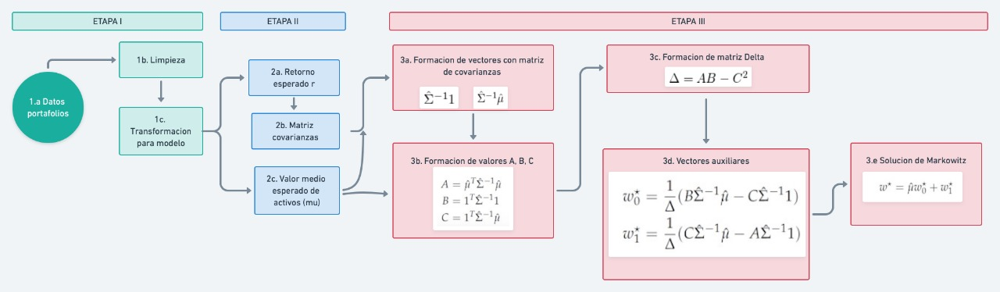

# Implementación del modelo Markowitz a cómputo en paralelo

## Organización

Para el desarrollo del proyecto, los integrantes se dividieron principalmente en dos grupos; el **Grupo de programación** encargado de la implementación de los métodos y algoritmos; y el **Grupo de revisión** encargado de probar y reportar los métodos del primer grupo. Ambos grupos fueron coordinados por el **Project Manager** con ayuda de un **Asistente**.

La división anterior se puede resumir mediante la siguiente tabla:

| #    | Rol                                   | Persona      |
| ---- | --------------------------------------| ------------ |
| 1    | Grupo de programación                 | Bruno        |
| 2    | Grupo de programación                 | Itzel        |
| 3    | Grupo de programación                 | César        |
| 4    | Grupo de revisión                     | León         |
| 5    | Grupo de revisión/Asistente de PM     | Danahi       |
| 6    | Project Manager                       | Yalidt       |

## Descripción del problema

Se busca desallorar un algoritmo(en paralelo) para encontrar la proporción de dinero que cierto inversionista debe invertir en un conjunto de acciones. A estas proporciones las denotaremos **wi**, que finalmente es un vector de tamaño nx1, donde n es el número de acciones a analizar. Este algoritmo se basa en el modelo de Markovitz, que de acuerdo a una frontera de posibilidades de alocación se busca la parte superior de esa frontera, ya que justamente en esa parte los rendimientos son positivos.

La finalidad del algoritmo será encontrar el portafolio de **mínima varianza**, el cual es para aquellos inversionistas que son aversos al riesgo.

## Metodología
1) Obtener base de datos de precios históricos de 55 empresas que coticen en bolsa, se obtendrá un conjunto de empresas por cada industria en el mercado. Esta infromación la obtendremos de CapitalIQ y los precios serán diarios **Closed Price**, es decir al cierre de la bolsa. Debido a que es una plataforma privada no se puede extraer la información directamente, por lo que en nuestro proyecto no hay un proceso de EL.

2) Se calcularán los rendimientos esperados de cada una de las empresas con los precios de acuerdo a la siguiente fórmula:
 

3) Determinar el vector de pesos , se puede asignar aleatoriamente entre %24) con la condición de que la suma de la entradas sea igual a 1. 
4) Obtener el rendimiento esperado del portafolio  

5) Obtener la matriz de varianzas y covarianzas de los rendimientos de las acciones  

6) Definir la función a optimizar   
7) Establecer las restricciones del modelo 
 
 
 

* Donde los vectores auxiliares son los siguientes: 
) 
) 
Donde : 
 
 
 

## Diagrama de Flujo

En este sentido, para llevar a cambo la implementación descrito en la sección precedente, se propuso descomponer en una serie de etapas que facilitan la implementación colaborativa y el emsable del código.

* **Etapa I:** se refiere a la obtención de los datos de portafolios a analizar, junto con su limpieza y transformación para posteriores análisis,
* **Etapa II:** corresponde a la estimación de tres elementos base del modelo, a saber el retorno esperado de los activos, el valor medio esperado de los mismo junto con la matriz de covarianzas asociada.
* **Etapa III:** relativa a la aproximación de la composición de los pesos que permite integrar el portafolio de inversión que posee **mínima varianza**, el cual es para aquellos inversionistas que son aversos al riesgo.

El proceso en comento, se resumen a continuación:

## Referencias 

Bodie, Z., Kane, A., & Marcus, A. J. (2011). Investments. New York: McGraw-Hill/Irwin. 
https://www.niceideas.ch/airxcell_doc/doc/userGuide/portfolio_optimTheory.html 

