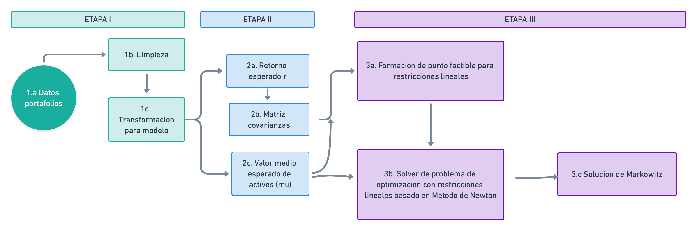

# Implementación del modelo Markowitz

## 0. Índice

+ [Descripcion del problema](#id1)
+ [Consideraciones metodológicas](#id2)
  + [Portafolio de activos y sus rendimiento](#id3)
  + [Solver basado en multiplicadores de Lagrange](#id4)
  + [Solver basado en método de Newton](#id5)
+ [Organización del equipo](#id6)
+ [Flujo de trabajo en Github](#id7)
+ [Requerimientos de infraestructura](#id8)
+ [Organización del proyecto](#id9)
+ [Referencias](#id10)


## 1. Descripción del problema<a name="id1"></a>

En el contexto de finanzas, un problema relevante es definir estrategias que permitan a los inversionista diversificar sus inversiones con el objetivo de minimizar el riesgo de su capital. Típicamente, esto corresponde con que un inversionista tiene interés en un conjunto definido de activos, denominado *portafolio*, sobre el que debe tomar una decisión sobre como adquirir o vender acciones con la idea obtener un determinado rendimiento .
Sin embargo, es deseable que la elección considere reducir el riesgo inherente al mercado de inversiones, los que se traduce en obtener el portafolio de *mínima varianza*, que en otras palabras significa obtener el portafolio de menor riesgo para inversionistas aversos al riesgo, donde se espera obtener las ponderaciones o proporciones que el inversionista debe invertir en las acciones evaluadas en un vector de todo el conjunto de acciones.

En términos matemáticos y considerando la consabida teoría financiera, lo anterior equivale a una formulación denominada *Modelo de Markowitz*, propuesta por el economista Harry Markowitz, a través de la cual se trata de minimizar la norma inducida por la matriz de covarianza  de los activos con referencia a los propociones de como se debe elegir las acciones que integranun portafolio específico (pesos), sujeto a que se obtenga un rendimiento acorde a la expectativa del inversionista. A estas proporciones las denotaremos ****, que finalmente es un vector de tamaño , donde  es el número de acciones a analizar.

Ello constituye  un **problema de optimización sujeto a restricciones (lineales) de igualdad**, que se puede expresar en los términos siguientes:


Sujeto a las restricciones lineales:
- El inversionista el rendimiento que vislumbra: 
- Los pesos de los activos se encuentran distribuidos congruentemente sobre el portafolio; 


Resolver este problema nos permite encontrar como se integra el portafolio que dado un rendimiento  esperado el inversionista, tenga varianza **mínima varianza** , el cual corresponde con el perfil de los inversionistas que son aversos al riesgo.  Es decir, nos permite conocer los pesos de un portafolio que, de acuerdo a una frontera de posibilidades de alocación y un rendimiento esperado, se localiza en frontera superior de entre todos los portafolios de inversión según su varianza, tal como se aprecia en la curva de la imagen:


Es así que  propósito de este proyecto será desarrollar estrategias que permitan resolver el modelo de Markowitz empleando herramientas de optimización y cómputo distribuido, particularmente aprovechando la disponibilidad de tarjetas GPU, así como el framework Cupy de Python para este tipo de  hardware. En adición, en este proyecto se busca echar mano de herramientas de computo en la nube y ambientes de virtualización, concretamente AWS y Docker.

A continuación se describen la estructura del presente repositorio, así como los algoritmos planteados para dar solución al modelo en cuestión.


## 2. Consideraciones metodológicas<a name="id2"></a>

### 2.1 Portafolio de activos, sus rendimientos y pesos<a name="id3"></a>

* Tras analizar las fuentes de datos disponibles, se estimó pertinente considerar precios históricos de las 50 empresas, que destacan en sus correspondientes industria,  seleccionándose las que tienen mayor participación en el mercado (al momento de realizar este proyecto). En concreto, se consideraron  las empresas:

|Código Bursátil| Nombre de la empresa                           | Industria               |
| --------- | ------------------------------------------------| ----------------------- |
| XOM       | Exxon Mobil Corporation                         | Energía                 |
| CVX       | Chevron Corporation                             | Energía                 |
|RDSA.AS    | Royal Dutch Shell                               | Energía                 |
|RELIANCE.NS| Reliance Industries Limited                      | Energía                 |
| COP       | Conoco Phillips                                  | Energía                 |
| AMT       | American Tower Corporation                      | Inmobiliaria            |
| CCI       | Crown Castle International Corp                 | Inmobiliaria            |
| PLD       | Prologis, Inc                                   | Inmobiliaria            |
| DLR       | Digital Realty Trust, Inc                       | Inmobiliaria            |
| 0688.HK   | China Overseas Land & Investment Limited        | Inmobiliaria            |
| LIN       | Linde plc                                       | Materiales              |
| BHP.AX    | BHP Group                                       | Materiales              |
| RIO.L     | Rio tinto Group                                 | Materiales              |
| AI.PA     | L'Air Liquide S.A                               | Materiales              |
| 2010.SR   | Saudi Basic Industries                          | Materiales              |
| LMT       | Lockhedd Martin Corporation                     | Materiales Industriales |
| HON       | Honeywell International Inc                     | Materiales Industriales |
| UPS       | United Parcel Service. Inc                      | Materiales Industriales |
| UNP       | Union Pacific Corporation                       | Materiales Industriales |
| RTX       | Raytheon Technologies Corporation               | Materiales Industriales |
| AMZN      | Amazon.com, Inc                                 | Consumo Discrecional    |
| BABA      | Alibaba Group Holding Limited                   | Consumo Discrecional    |
| HD        | The Home Depot, Inc                             | Consumo Discrecional    |
| MC.PA     | LVMH Louis Vuitton, Société Europèenne          | Consumo Discrecional    |
| 7203.T    | Toyota Motor Corporation                        | Consumo Discrecional    |
| WMT       | Walmart Inc                                     | Retail                  |
| PG        | PThe Procter & Gamble Company                   | Retail                  |
| KO        | The Coco-Cola Company                           | Retail                  |
| PEP       | PesiCo Inc                                      | Retail                  |
| NSRGY     | Nestlé S.A                                      | Retail                  |
| JNJ       | ohnson & Johnson                                | Cuidado Personal        |
| UNH       | UnitedHealth Group Incorporated                 | Cuidado Personal        |
| PFE       | Pfizer Inc                                      | Cuidado Personal        |
| MRK       | Merk & Co., Inc                                 | Cuidado Personal        |
| RHHBY     | Roche Holding AG                                | Cuidado Personal        |
| VTI       | Vanguard Total Stock Market ETF                  | Financiera              |
| VOO       | Vanguard S&P 500 ETF                            | Financiera              |
| BRK-A     | Bekshire Hathaway Inc                           | Financiera              |
| 1398.HK   | Industrial and Commercial Bank of China Limited | Financiera              |
| JPM       | JPMorgan Chase & Co                             | Financiera              |
| MSTF      | Microsoft Corporation                           | Tecnología              |
| APPL      | Apple Inc                                       | Tecnología              |
| V         | Visa Inc                                        | Tecnología              |
| 005930.KS | Samsung Electronics                             | Tecnología              |
| MA        | Mastercard Incorporated                         | Tecnología              |
| GOOG.L    | Alphabet Inc                                    | Comunicación            |
| FB        | Facebook, Inc                                   | Comunicación            |
| 0700.HK   | Tencent Holdings Limited                        | Comunicación            |
| VS        | Verizon Communications Inc                      | Comunicación            |
| T         | AT&T Inc                                        | Comunicación            |


* Para considerar el comportamiento histórico de las acciones de dichas empresas, se consideró la información financiera de los últimos 5 años para hacer el análisis (esto es, desde el 1 de enero de 2015 al 30 de abril de 2020). Dicha información se obtuvo del API de Python que permite obtener datos desde Yahoo Finance, considerándose como valores de referencia de los activos a los precios diarios **Closed Price** (es decir, los precios al cierre de la bolsa).

* En complemento, para el cálculo de los rendimientos esperados de cada una de las empresas, se estímó pertinente evaluarlo a través de los precios de cierre diarios a partir de la fórmula del *rendimiento instantáneo* en escala logarítimica:

<br />

Ello para evitar problemas numéricos debidos a la escala de los rendimientos.

* En lo tocante a como se debe determinar el vector de pesos asociado al portafolio de activos, se consideró relevante pensarlos como una proporción, lo que equivale a que la suma de la entradas sea igual a 1.

* Por otro lado, el rendimiento esperado del portafolio se obtiene haciendo el producto punto del vector de rendimientos medios de los activos en el periodo en cuestión y los pesos del portafolio elegido, cumpliendo los portafolios factibles la restricción . Nota: estos pesos pueden ser negativos porque asumimos que pueden existir ventas en corto (*short sale*), lo cual implica que los inversores podrían tener una ganancia si tienen algún contrato de préstamo de títulos accionarios, los cuales deben devolver a una fecha futura y podrían devolverlos a un precio menor.

* Finalmente, la matriz de varianzas y covarianzas de los portafolios se calcula como las correspondientes matrices de varianzas y covarianzas rendimientos de las acciones en el periodo de los últimos 5 años para hacer el análisis (1 de enero de 2015 al 30 de abril de 2020).


### 2.2 Solver basado en multiplicadores de Lagrage<a name="id4"></a>

En este caso, el problema de minimización se aborda calculando la solución analítica del problema de optimización recién descrito, empleando la expresión del Lagrangiano del
problema de optimización considerando las respectivas restricciones, aprovechando que la matriz de covarianzas es simétrica y definida positiva.

**Solución:** Aplicar el método de multiplicadores de Lagrange al problema de optimización convexa (minimización) sujeto a restricciones lineales del Modelo de Markowitz:

- Definimos el Lagrangiano del problema:

%20%3D%20%5Cfrac%7B1%7D%7B2%7Dw%5ET%5CSigma%20w%20%2B%20%20%5Clambda_%7B1%7D(r-w%5ET%5Cmu)%20%2B%20%5Clambda_%7B2%7D(1-w%5ET1_%7Bn%7D))

- En consecuencia, las condiciones de primer orden que debe satisfacer el punto factible del problema, quedan en función de lo siguiente:

  * 

  * 

  * 

- Resolviendo para **w** en términos de 


- Por otro lado, resolviendo para  y sustituyendo para **w** se sigue:

  * %20%2B%20%5Clambda_%7B2%7D(%5Cmu%5ET%5CSigma%5E%7B-1%7D1_%7Bn%7D))
  * %20%2B%20%5Clambda_%7B2%7D(1%5ET_%7Bn%7D%5CSigma%5E%7B-1%7D1_%7Bn%7D))

Es sencillo ver que las ecuaciones previas pueden ser resueltas de manera analítica el resolver el sistema lineal:


En donde:

* ,
* 
* 

De lo anterior y tras un poco de álgebra, se puede pRobrar que la solución del sistema de Markowitz se puede encontrar como sigue:

Formamos al vector %2Bw_%7B1%7D%5Ccdot%20(%5CSigma%5E%7B-1%7D%5Ccdot%201))<br />
  * Donde los vectores involucrados tienen las siguientes expresiones:<br />
)<br />
)<br />

* Donde :<br />
  * <br />
  * <br />
  * <br />
  * 

#### 2.2.1 Diagrama de flujo del solver basado en multiplicadores de Lagrage

La implementación de este método se dividió en una serie de etapas:

* **Etapa I:** se refiere a la obtención de los datos de portafolios a analizar, junto con su limpieza y transformación para posteriores análisis,
* **Etapa II:** corresponde a la estimación de tres elementos base del modelo, a saber el retorno esperado de los activos, el valor medio esperado de los mismo junto con la matriz de covarianzas asociada.
* **Etapa III:** relativa a la aproximación de la composición de los pesos que permite integrar el portafolio de inversión que posee **mínima varianza**, el cual es para aquellos inversionistas que son aversos al riesgo.

El proceso comentado, se resumen a continuación:


### 2.3 Solver basado en el método de Newton con restricciones de igualdad<a name="id5"></a>

Es relevante destacar que en la teoría de optimización, es posible aproximar las soluciones de un problema de optimización sujeto a restricciones lineales, si se cumplen ciertos supuestos:

* La función objetivo es convexa y dos veces continuamente diferenciables,
* El número de restricciones es menor al número de variables y tales restricciones son idenpendientes,

En tal caso, es posible probar que por condiciones necesarias y suficientes de Karush-Kuhn-Tucker (también conocidas como las condiciones KKT o Kuhn-Tucker), es posible observar que la solución del problema de minimización equivale a resolver un problema denominado "dual". Concretamente se sabe que, existe una equivalencia lógica entre las siguientes proposiciones:

* ) es óptimo
* %2B%20A%5ET%20%5Cnu%5E*%3D0))

Nota: típicamente las ecuaciones involucradas se denominan a través de la siguiente terminología:

* Ecuaciones de factbilidad primal: 
* Ecuaciones de factbilidad dual: %2B%20A%5ET%20%5Cnu%5E*%3D0)

Aprovechando lo anterior, se puede extender el método de Newton para resolver las ecuaciones de KKT, de manera que pueda aproximarse la solución del problema de optimización original; ello se basa en los siguientes hechos:

* a) El punto inicial debe ser factible, es decir debe estar en el dominio de la función objetivo y satisfacer las restricciones lineales,
* b) El paso de Newton se debe modificar para que satisfaga las conducentes restricciones.
* c) Lo anterior se puede lograr aproximando la función objetivo, considerando su expansión derivada del teorema de Taylor hasta el término de segundo orden, ), de modo que puede considerarse un nuevo problema de optimización dado por ) sujeto a %3Db).
* d) El paso de Newton en un punto , se define como la solución única al problema de minimización cuadrática previo con matriz KKT no singular; el cual se denota específicamente como  y se encuentra en términos de las ecuaciones matriciales:


%20%26%20A%5ET%20%5C%5C%20A%20%26%200%20%20%5Cend%7Bbmatrix%7D%20)  %20%20%5C%5C%200%20%20%5Cend%7Bbmatrix%7D%20)

En este caso *w* es la variable óptima dual asociada.

Notas:
1) En este caso, las implementaciones típicamente echan mano de una cantidad conocida como *decremento de Newton*
%3D(%5CDelta%20%7Bx_n%7D_t%5ET%20%5Cnabla%5E2%20f(x)%20%5CDelta%20%7Bx_n%7D_t)%5E%7B1%2F2%7D), la cual guarda información útil en las búsquedas de direcciones factibles, como las búsquedas de línea y que puede emplearse como criterio de paro en procesos iterativos, como en el que nos ocupa,

Con todos los elementos anteriores, nos encontramos en condiciones de describir el Algortimo del método de Newton para un problema de optimización con restricciones de igualdad:

* Repetir hasta convergencia:
  * 1. Calcular el paso y decremento de Newton, )
  * 2. *Revisar criterio de paro:* terminar método si %7D%7B2%7D%20%5Cleq%20%5Cepsilon),
  * 3. *Búsqueda de línea:* elegir el método de paso por backtracking line search,
  * 4. *Actualizar:* 


#### 2.3.1 Diagrama de flujo del solver basado en el método de Newton con restricciones de igualdad

La implementación de este método se dividió en una serie de etapas:

* **Etapa I:** se refiere a la obtención de los datos de portafolios a analizar, junto con su limpieza y transformación para posteriores análisis,
* **Etapa II:** corresponde a la estimación de tres elementos base del modelo, a saber el retorno esperado de los activos, el valor medio esperado de los mismo junto con la matriz de covarianzas asociada.
* **Etapa III:** relativa a la aproximación de la solución del problema original de optimización con el algortimo recién descrito, lo que posibilidad aproximar los pesos que permiten integrar el portafolio de inversión que posee **mínima varianza**, el cual es para aquellos inversionistas que son aversos al riesgo. En este caso, se obtiene primero una propuesta de punto factible del problema de Markowitz (esencialmente, obtenida resolviendo las ecuaciones normales asociadas a las restricciones lineales) la cual alimenta al solver del problema de optimización con restricciones que se basado en el método de Newton para aproximar una solución del problema de optimización, siguiendo las consideraciones expuestas en la sección previa.

El proceso comentado, se resumen a continuación:



## 3. Organización del equipo<a name="id6"></a>

Para el desarrollo del proyecto, los integrantes se dividieron principalmente en dos grupos; el **Grupo de programación** encargado de la implementación de los métodos y algoritmos; y el **Grupo de revisión** encargado de probar y reportar los métodos del primer grupo. Ambos grupos fueron coordinados por el **Project Manager** con ayuda de un **Asistente**.

La división anterior se puede resumir mediante la siguiente tabla:

**Fase 1: Implementación empleando método de Lagrange**

| #    | Rol                                   | Persona      |
| ---- | --------------------------------------| ------------ |
| 1    | Grupo de programación                 | Bruno        |
| 2    | Grupo de programación                 | Itzel        |
| 3    | Grupo de programación                 | César        |
| 4    | Grupo de revisión                     | León         |
| 5    | Grupo de revisión/Asistente de PM     | Danahi       |
| 6    | Project Manager                       | Yalidt       |

**Fase 2: Implementación usando método de Newton**

| #    | Rol                                        | Persona      |
| ---- | -------------------------------------------| ------------ |
| 1    | Grupo de programación                      | Bruno        |
| 2    | Grupo de programación                      | Itzel        |
| 3    | Grupo de programación                      | César        |
| 4    | Grupo de revisión/ Ayudante de programación| León         |
| 5    | Grupo de revisión/ Contexto Teórico        | Yalidt       |
| 6    | Project Manager                            | Danahi       |

## 4. Flujo de trabajo en Github<a name="id7"></a>

Para facilitar el desarrollo de forma colaborativa entre los equipos de programación y revisión, se siguió un *Github flow*, que consistió, en líneas generales, en la creación de ramas para resolver un issue específico, para solicitar la revisión del PM a través de un *Pull request*, y su posterior aprobación para unir los cambios hacia la rama *master*.


**Fuente:** Notas del curso *Programación para Ciencia de Datos* de la Maestría en Ciencia de Datos del ITAM (2019). Véase https://github.com/ITAM-DS/programming-for-data-science-2019/blob/master/handbook.pdf

Cabe destacar que una vez solucionado el issue correspondiente, se borró la rama asociada para facilitar el entendimiento y administración del proyecto.

## 5. Requerimientos de infraestructura<a name="id8"></a>
A efecto de que el los equipos de programación y revisión tuvieran un entorno común de trabajo para el desarrollo del proyecto, se empleó Google Colab. Para las pruebas en AWS, se usó una instancia con las siguientes características:

[WIP: especificar]

## 6. Organización del proyecto<a name="id9"></a>

La organización del proyecto se realizó a través una serie de carpetas, entre las cuales destacan:

* [notebooks](https://github.com/czammar/MNO_finalproject/tree/master/notebooks)

Esta carpeta se subdivide en dos, Programación y Revisión donde se realizan las implementaciones en python para los solvers de multiplicador de Lagrange y método de Newton así como la revisión de este código.

  * [Programación](https://github.com/czammar/MNO_finalproject/tree/master/notebooks/Programacion) En esta carpeta se encuentran notebooks por separado que forman parte de los diagramas de flujo 2.2.1 y 2.3.1 así como una     carpeta [solver](https://github.com/czammar/MNO_finalproject/tree/master/notebooks/Programacion/solver) donde se encuentran   los archivos .py que implementan los solvers de multiplicador de lagrange y método de Newton.

  * [Revisión](https://github.com/czammar/MNO_finalproject/tree/master/notebooks/Revision)
  
* [infraestructure](https://github.com/czammar/MNO_finalproject/tree/master/infrastructure)

Carpeta que contiene el dockerfile y donde se explican los pasos a seguir para levantar una instancia en AWS en donde se pueden ejecutar los códigos desarrollados para la implementación del modelo Markowitz en paralelo.

* [results](https://github.com/czammar/MNO_finalproject/tree/master/results)

Carpeta donde se desarrolla el reporte ejecutivo de resultados.


En complemento, se presenta una versión esquemática de la organización de repositorio del proyecto:

```bash
    .
    ├── LICENSE
    ├── README.md
    ├── burning_bus
    ├── conf
    │   ├── base
    │   └── local
    ├── docs
    ├── images
    ├── infrastructure        <- Carpeta de infraestructura AWS y Docker
    │   ├── Dockerfile
    │   ├── Readme.md
    │   └── Solver_AWS.ipynb
    ├── notebooks
    │   ├── Programacion      <- Carpeta de reportes de programacion
    │   └── Revision          <- Carpeta de reportes de revision
    ├── references
    │   ├── Minutas
    │   └── algorithms_for_ceco.py
    ├── requirements-dev.txt
    ├── requirements.txt
    ├── results                <- Carpeta de reporte ejecutivo de resultados
    │   └── ReporteResultados.ipynb
    ├── setup.py
    ├── sql
    └── src
        ├── __init__.py
        ├── etl
        ├── pipeline
        └── utils

    18 directories, 17 files

```


## Referencias<a name="id10"></a>

* Bodie, Z., Kane, A., & Marcus, A. J. (2011). Investments. New York: McGraw-Hill/Irwin.
https://www.niceideas.ch/airxcell_doc/doc/userGuide/portfolio_optimTheory.html
* Topics in mathematics with applications in finance, MIT 18.S096, Lecture 14 Portfolio Theory, Fall 2013, Dr. Kempthorne,  https://ocw.mit.edu/courses/mathematics/18-s096-topics-in-mathematics-with-applications-in-finance-fall-2013/lecture-notes/MIT18_S096F13_lecnote14.pdf
* Notas del curso de Métodos Numéricos y Optimización, ITAM, Moreno Palacios Erick, 2020 https://drive.google.com/file/d/12L7rOCgW7NEKl_xJbIGZz05XXVrOaPBz/view
