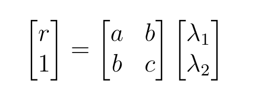
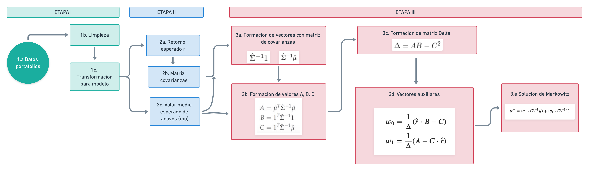

# Implementación del modelo Markowitz

## 1. Índice

+ Descripcion del problema
+ Consideraciones metodológicas:
  + Portafolio de activos y sus rendimiento,
  + Solver basado en multiplicadores de Lagrange,
  + Solver basado en método de Newton,
+ Estructura del repositorio,
+ Instrucciones para AWS y Docker
+ Reporte de Resultados
+ Reportes de Equipos:
  + Programación
  + Revisión

[WIP: Añadir índice al repositorios y referencias cruzadas]

## 2. Descripción del problema

En el contexto de finanzas, un problema relevante es definir estrategias que permitan a los inversionista diversificar sus inversiones con el objetivo de minimizar el riesgo de su capital. Típicamente, esto corresponde con que un inversionista tiene interés en un conjunto definido de activos, denominado *portafolio*, sobre el que debe tomar una decisión sobre como adquirir o vender acciones con la idea obtener un determinado rendimiento .
Sin embargo, es deseable que la elección considere reducir el riesgo inherente al mercado de inversiones, los que se traduce en obtener el portafolio de *mínima varianza*, que en otras palabras significa obtener el portafolio de menor riesgo para inversionistas aversos al riesgo, donde se espera obtener las ponderaciones o proporciones que el inversionista debe invertir en las acciones evaluadas en un vector de todo el conjunto de acciones.

En términos matemáticos y considerando la consabida teoría financiera, lo anterior equivale a una formulación denominada *Modelo de Markowitz*, propuesta por el economista Harry Markowitz, a través de la cual se trata de minimizar la norma inducida por la matriz de covarianza  de los activos con referencia a los propociones de como se debe elegir las acciones que integranun portafolio específico (pesos), sujeto a que se obtenga un rendimiento acorde a la expectativa del inversionista. A estas proporciones las denotaremos ****, que finalmente es un vector de tamaño , donde  es el número de acciones a analizar.

Ello constituye  un **problema de optimización sujeto a restricciones (lineales) de igualdad**, que se puede expresar en los términos siguientes:

Sujeto a las restricciones lineales:
- El inversionista el rendimiento que vislumbra: 
- Los pesos de los activos se encuentran distribuidos congruentemente sobre el portafolio; 

Resolver este problema nos permite encontrar como se integra el portafolio que dado un rendimiento  esperado el inversionista, tenga varianza **mínima varianza** , el cual corresponde con el perfil de los inversionistas que son aversos al riesgo.  Es decir, nos permite conocer los pesos de un portafolio que, de acuerdo a una frontera de posibilidades de alocación y un rendimiento esperado, se localiza en frontera superior de entre todos los portafolios de inversión según su varianza, tal como se aprecia en la curva de la imagen:

Es así que  propósito de este proyecto será desarrollar estrategias que permitan resolver el modelo de Markowitz empleando herramientas de optimización y cómputo distribuido, particularmente aprovechando la disponibilidad de tarjetas GPU, así como el framework Cupy de Python para este tipo de  hardware. En adición, en este proyecto se busca echar mano de herramientas de computo en la nube y ambientes de virtualización, concretamente AWS y Docker.

A continuación se describen la estructura del presente repositorio, así como los algoritmos planteados para dar solución al modelo en cuestión.

## 3. Consideraciones metodológicas

### 3.1 Portafolio de activos, sus rendimientos y pesos.

* Tras analizar las fuentes de datos disponibles, se estableció considerar precios históricos de las 50 empresas, que destacan en sus correspondientes industria,  seleccionándose las que tienen mayor participación en el mercado (al momento de realizar este proyecto). En concreto, se consideraron  las empresas:

[WIP: Añadir tabla de nombre de empresas junto con sus acrónimos]

* Para considerar el comportamiento histórico de las acciones de dichas empresas, se consideró la información financiera de los últimos 5 años para hacer el análisis (esto es, desde el 1 de enero de 2015 al 30 de abril de 2020). Dicha información se obtuvo del API de Python que permite obtener datos desde Yahoo Finance, considerándose como valores de referencia de los activos a los precios diarios **Closed Price** (es decir, los precios al cierre de la bolsa).

* En complemento, para el cálculo de los rendimientos esperados de cada una de las empresas, se estímó pertinente evaluarlo a través de los precios de cierre diarios a partir de la fórmula del *rendimiento instantáneo* en escala logarítimica:

 

Ello para evitar problemas numéricos debidos a la escala de los rendimientos.

* En lo tocante a como se debe determinar el vector de pesos asociado al portafolio de activos, se consideró relevante pensarlos como una proporción, lo que equivale a que la suma de la entradas sea igual a 1.

* Por otro lado, el rendimiento esperado del portafolio se obtiene haciendo el producto punto del vector de rendimientos medios de los activos en el periodo en cuestión y los pesos del portafolio elegido, cumpliendo los portafolios factibles la restricción . Nota: estos pesos pueden ser negativos porque asumimos que pueden existir ventas en corto (*short sale*), lo cual implica que los inversores podrían tener una ganancia si tienen algún contrato de préstamo de títulos accionarios, los cuales deben devolver a una fecha futura y podrían devolverlos a un precio menor.

* Finalmente, la matriz de varianzas y covarianzas de los portafolios se calcula como las correspondientes matrices de varianzas y covarianzas rendimientos de las acciones en el periodo de los últimos 5 años para hacer el análisis (1 de enero de 2015 al 30 de abril de 2020).

### 3.2 Solver basado en multiplicadores de Lagrage

En este caso, el problema de minimización se aborda calculando la solución analítica del problema de optimización recién descrito, empleando la expresión del Lagrangiano del
problema de optimización considerando las respectivas restricciones, aprovechando que la matriz de covarianzas es simétrica y definida positiva.

**Solución:** Aplicar el método de multiplicadores de Lagrange al problema de optimización convexa (minimización) sujeto a restricciones lineales del Modelo de Markowitz:

- Definimos el Lagrangiano del problema:

%20%3D%20%5Cfrac%7B1%7D%7B2%7Dw%5ET%5CSigma%20w%20%2B%20%20%5Clambda_%7B1%7D(r-w%5ET%5Cmu)%20%2B%20%5Clambda_%7B2%7D(1-w%5ET1_%7Bn%7D))

- En consecuencia, las condiciones de primer orden que debe satisfacer el punto factible del problema, quedan en función de lo siguiente:

  * 

  * 

  * 

- Resolviendo para **w** en términos de 

- Por otro lado, resolviendo para  y sustituyendo para **w** se sigue:

  * %20%2B%20%5Clambda_%7B2%7D(%5Cmu%5ET%5CSigma%5E%7B-1%7D1_%7Bn%7D))
  * %20%2B%20%5Clambda_%7B2%7D(1%5ET_%7Bn%7D%5CSigma%5E%7B-1%7D1_%7Bn%7D))

Es sencillo ver que las ecuaciones previas pueden ser resueltas de manera analítica el resolver el sistema lineal:

En donde:

* ,
* 
* 

De lo anterior y tras un poco de álgebra, se puede pRobrar que la solución del sistema de Markowitz se puede encontrar como sigue:

Formamos al vector %2Bw_%7B1%7D%5Ccdot%20(%5CSigma%5E%7B-1%7D%5Ccdot%201)) 
  * Donde los vectores involucrados tienen las siguientes expresiones: 
) 
) 

* Donde : 
  *  
  *  
  *  
  * 

#### 3.2.1 Diagrama de flujo del solver basado en multiplicadores de Lagrage

La implementación de este método se dividió en una serie de etapas:

* **Etapa I:** se refiere a la obtención de los datos de portafolios a analizar, junto con su limpieza y transformación para posteriores análisis,
* **Etapa II:** corresponde a la estimación de tres elementos base del modelo, a saber el retorno esperado de los activos, el valor medio esperado de los mismo junto con la matriz de covarianzas asociada.
* **Etapa III:** relativa a la aproximación de la composición de los pesos que permite integrar el portafolio de inversión que posee **mínima varianza**, el cual es para aquellos inversionistas que son aversos al riesgo.

El proceso comentado, se resumen a continuación:

### 3.3 Solver basado en el método de Newton con restricciones de igualdad

Es relevante destacar que en la teoría de optimización, es posible aproximar las soluciones de un problema de optimización sujeto a restricciones lineales

Consideraciones:

1) El punto inicial debe ser factible, es decir:  ,  y 

2) El paso de Newton , debe modificarse de modo que satisfaga las reestricciones.

#### 3.3.1 Diagrama de flujo del solver basado en el método de Newton con restricciones de igualdad

La implementación de este método se dividió en una serie de etapas:

* **Etapa I:** se refiere a ...,
* **Etapa II:** corresponde a la estimación de ...
* **Etapa III:** relativa a la aproximación de ...

El proceso comentado, se resumen a continuación:

[WIP: modificar diagrama]

### Aproximación de segundo orden
Supongase que w es un punto factible del problema y desarrollese vía el teorema de Taylor la aproximación de segundo orden con centro en el punto w para f

Entonces el problema que se resolvera es:
min 

Sujeto a:
- 
- 

con variable  , el cual como f es convexa es un problema convexo de minimización cuadrática con reestricciones de igualdad.

## Organización del equipo

Para el desarrollo del proyecto, los integrantes se dividieron principalmente en dos grupos; el **Grupo de programación** encargado de la implementación de los métodos y algoritmos; y el **Grupo de revisión** encargado de probar y reportar los métodos del primer grupo. Ambos grupos fueron coordinados por el **Project Manager** con ayuda de un **Asistente**.

La división anterior se puede resumir mediante la siguiente tabla:

**Fase 1: Implementación empleando método de Lagrange**

| #    | Rol                                   | Persona      |
| ---- | --------------------------------------| ------------ |
| 1    | Grupo de programación                 | Bruno        |
| 2    | Grupo de programación                 | Itzel        |
| 3    | Grupo de programación                 | César        |
| 4    | Grupo de revisión                     | León         |
| 5    | Grupo de revisión/Asistente de PM     | Danahi       |
| 6    | Project Manager                       | Yalidt       |

**Fase 2: Implementación usando método de Newton**

| #    | Rol                                        | Persona      |
| ---- | -------------------------------------------| ------------ |
| 1    | Grupo de programación                      | Bruno        |
| 2    | Grupo de programación                      | Itzel        |
| 3    | Grupo de programación                      | César        |
| 4    | Grupo de revisión/ Ayudante de programación| León         |
| 5    | Grupo de revisión/ Contexto Teórico        | Yalidt       |
| 6    | Project Manager                            | Danahi       |

## Referencias

* Bodie, Z., Kane, A., & Marcus, A. J. (2011). Investments. New York: McGraw-Hill/Irwin.
https://www.niceideas.ch/airxcell_doc/doc/userGuide/portfolio_optimTheory.html
* Topics in mathematics with applications in finance, MIT 18.S096, Lecture 14 Portfolio Theory, Fall 2013, Dr. Kempthorne,  https://ocw.mit.edu/courses/mathematics/18-s096-topics-in-mathematics-with-applications-in-finance-fall-2013/lecture-notes/MIT18_S096F13_lecnote14.pdf
* Notas del curso de Métodos Numéricos y Optimización, ITAM, Moreno Palacios Erick, 2020 https://drive.google.com/file/d/12L7rOCgW7NEKl_xJbIGZz05XXVrOaPBz/view
